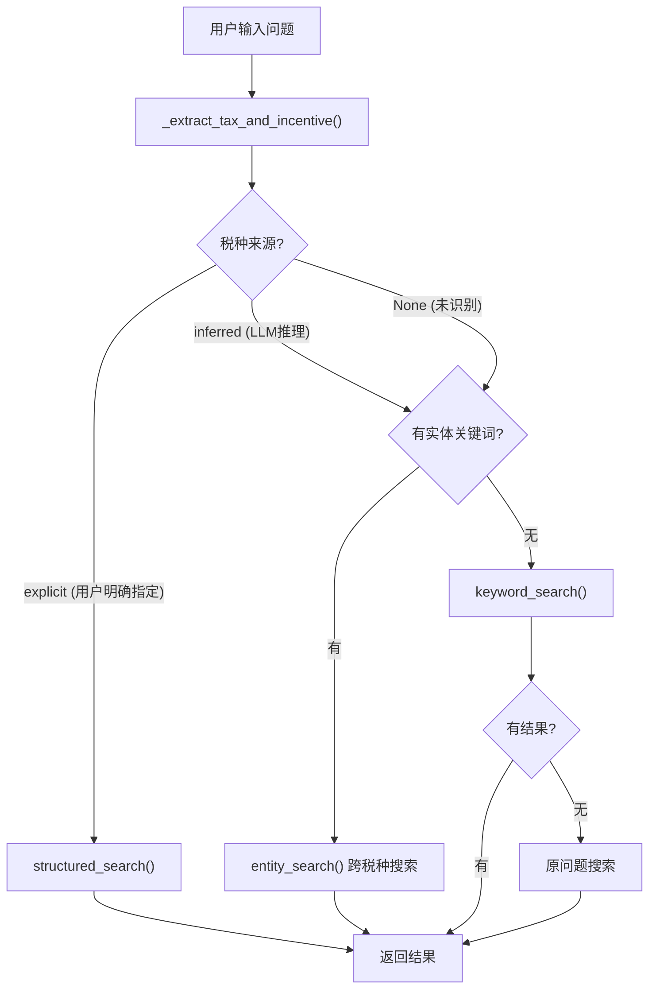

# 税收优惠查询问题调试备忘录

> 调试日期: 2026-01-16  
> 问题: "小微企业优惠有哪些"未能正确返回小微企业相关政策

---

## 一、问题描述

**用户查询**: "小微企业优惠有哪些"

**错误现象**: 系统返回"找到20条相关政策"，但回答中说"所有列出的优惠政策均未直接针对小微企业这一主体"。

**期望结果**: 应返回数据库中所有与小微企业相关的优惠政策（企业所得税+增值税）。

---

## 二、数据库结构

### 2.1 数据库文件

| 项目 | 值 |
|------|-----|
| 文件路径 | `database/tax_incentives.db` |
| 主表 | `tax_incentives` |
| 全文索引表 | `tax_incentives_fts` (FTS5) |
| 总记录数 | 657条 |

### 2.2 tax_incentives 表结构

| # | 字段名 | 类型 | 说明 |
|---|--------|------|------|
| 0 | `id` | INTEGER | 主键 |
| 1 | `serial_number` | INTEGER | 序号 |
| 2 | `tax_type` | TEXT | **税种** (增值税/企业所得税/...) |
| 3 | `incentive_items` | TEXT | **优惠项目名称** |
| 4 | `qualification` | TEXT | 认定条件/资格要求 |
| 5 | `incentive_method` | TEXT | 优惠方式 (免征/减征/...) |
| 6 | `detailed_rules` | TEXT | 具体规定 |
| 7 | `legal_basis` | TEXT | 法律依据 |
| 8 | `special_notes` | TEXT | 特别说明 |
| 9 | `explanation` | TEXT | 解释说明 |
| 10 | `effective_date` | TEXT | 生效日期 |
| 11 | `expiry_date` | TEXT | 失效日期 |
| 12 | `applicable_region` | TEXT | 适用地区 |
| 13 | `policy_status` | TEXT | 政策状态 |
| 14 | `industry_scope` | TEXT | 行业范围 |
| 15 | `enterprise_type` | TEXT | 企业类型 |
| 16 | `discount_rate` | TEXT | 优惠比例 |
| 17 | `application_process` | TEXT | 申请流程 |
| 18 | `required_documents` | TEXT | 所需资料 |
| 19 | `data_source` | TEXT | 数据来源 |
| 20 | `data_quality` | INTEGER | 数据质量 |
| 21 | `last_verified_date` | TEXT | 最后验证日期 |
| 22 | `created_at` | TIMESTAMP | 创建时间 |
| 23 | `updated_at` | TIMESTAMP | 更新时间 |
| 24 | `keywords` | TEXT | **关键词** (用于搜索) |
| 25 | `tags` | TEXT | 标签 |

### 2.3 税种分布

| 税种 | 记录数 |
|------|--------|
| 增值税 | 247条 |
| 个人所得税 | 180条 |
| 企业所得税 | 119条 |
| 印花税 | 29条 |
| 房产税 | 28条 |
| 城镇土地使用税 | 21条 |
| 消费税 | 15条 |
| 土地增值税 | 10条 |
| 资源税 | 8条 |

### 2.4 小微企业相关数据

数据库中"小微企业"相关政策共 **7条**:

| ID | 税种 | 项目名称 | 匹配字段 |
|----|------|----------|----------|
| 113 | 增值税 | 小微企业 | incentive_items |
| 154 | 增值税 | 金融机构小微企业贷款利息 | incentive_items |
| 208 | 增值税 | 出租不动产 | detailed_rules |
| 314 | 企业所得税 | 小型微利企业 | incentive_items |
| 326 | 企业所得税 | 西藏自治区企业 | detailed_rules |
| 350 | 企业所得税 | 固定资产的加速折旧 | detailed_rules |
| 374 | 企业所得税 | 固定资产一次性扣除 | detailed_rules |

> **注意**: 企业所得税中使用"小型微利企业"而非"小微企业"，需做同义词扩展。

---

## 三、查询逻辑 (db_query.py)

### 3.1 核心类: TaxIncentiveQuery

文件路径: `modules/db_query.py`

```python
class TaxIncentiveQuery:
    """税收优惠政策查询类"""
    
    def __init__(self, db_path=None):
        # 默认路径: database/tax_incentives.db
        
    def search(question, limit=50) -> (results, total_count, query_intent)
    def _extract_tax_and_incentive(question) -> (tax_type, incentive_kw, entity_kw, intent, tax_source)
    def entity_search(entity_keywords, limit=50) -> List[Dict]       # 跨税种实体搜索
    def structured_search(tax_type, entity_keywords, limit=50) -> List[Dict]  # 结构化查询
    def keyword_search(keywords, limit=50) -> List[Dict]             # 关键词搜索
    def fulltext_search(query, limit=10) -> List[Dict]               # 全文搜索(FTS5)
```

### 3.2 查询流程图



### 3.3 策略优先级

| 优先级 | 条件 | 方法 | 说明 |
|--------|------|------|------|
| 1 | 用户明确指定税种 | `structured_search()` | 限定税种+实体关键词 |
| 2 | 有实体关键词 | `entity_search()` | 跨所有税种搜索 |
| 3 | 提取到关键词 | `keyword_search()` | OR连接多字段搜索 |
| 4 | 无任何匹配 | `keyword_search(原问题)` | 直接用原问题搜索 |

### 3.4 关键词提取 (_extract_tax_and_incentive)

**税种关键词** (按长度排序优先匹配):

```python
["城镇土地使用税", "企业所得税", "个人所得税", "土地增值税",
 "增值税", "印花税", "房产税", "消费税", "资源税", "车船税", "契税", "关税"]
```

**核心实体关键词**:

```python
["集成电路", "软件", "高新技术", "小微企业", "小型微利",
 "残疾人", "创业投资", "天使投资"]
```

**同义词扩展** (修复后新增):

```python
entity_synonyms = {
    "小微企业": ["小微企业", "小型微利", "小微"],
    "小型微利": ["小型微利", "小微企业", "小微"],
    "高新技术": ["高新技术", "高新企业"],
}
```

### 3.5 entity_search 实现

```python
def entity_search(self, entity_keywords: List[str], limit: int = 50) -> List[Dict]:
    """跨税种实体搜索"""
    # 1. 同义词扩展
    expanded_keywords = expand_synonyms(entity_keywords)
    
    # 2. 构建SQL (在多个字段中搜索)
    WHERE (
        incentive_items LIKE '%关键词%' 
        OR detailed_rules LIKE '%关键词%' 
        OR qualification LIKE '%关键词%'
        OR incentive_method LIKE '%关键词%'
        OR keywords LIKE '%关键词%'
        OR explanation LIKE '%关键词%'
    )
    ORDER BY tax_type  # 企业所得税优先
```

---

## 四、问题根因分析

### 4.1 调试过程

1. **验证数据库**: 确认数据库中有小微企业相关数据 (7条)
2. **追踪查询流程**: 发现 `keyword_search` 用 OR 连接关键词
3. **发现问题1**: "优惠"匹配大量无关记录,稀释了"小微企业"结果
4. **修复1**: 新增 `entity_search()` 跨税种实体搜索
5. **发现问题2**: DeepSeek推理税种后，仍进入 `structured_search`
6. **修复2**: 区分"用户明确指定"和"LLM推理"的税种

### 4.2 根因总结

| 问题 | 原因 | 修复 |
|------|------|------|
| 搜索结果被稀释 | `keyword_search` 用 OR 连接"优惠"和"小微企业" | 新增 `entity_search` 优先搜索实体 |
| 只返回企业所得税 | DeepSeek推理税种后限制了搜索范围 | 新增 `tax_type_source` 标记，区分用户指定/LLM推理 |
| 漏掉"小型微利企业" | "小微企业"与"小型微利企业"是同义词 | 新增同义词扩展逻辑 |

---

## 五、修复内容

### 5.1 修改文件

[db_query.py](file:///d:/MyProjects/MCP_coze/modules/db_query.py)

### 5.2 主要变更

1. **`_extract_tax_and_incentive()`** - 新增返回值 `tax_type_source`:
   - `"explicit"`: 用户明确指定税种
   - `"inferred"`: LLM推理税种
   - `None`: 未识别

2. **`search()`** - 修改策略判断:

   ```python
   if tax_type and tax_type_source == "explicit":
       # 用户明确指定 → structured_search
   elif entity_keywords:
       # 有实体关键词 → entity_search (跨税种)
   ```

3. **新增 `entity_search()`** - 跨税种实体搜索

4. **同义词扩展** - 在 `entity_search`, `structured_search`, `count_structured_results` 中添加

---

## 六、验证结果

| 查询 | 修复前 | 修复后 |
|------|--------|--------|
| "小微企业优惠有哪些" | 0条匹配 (20条无关结果) | **7条** (4企业所得税 + 3增值税) ✅ |
| "小微企业所得税优惠" | 0条匹配 | **4条** 企业所得税 ✅ |
| "增值税小微企业优惠" | 0条匹配 | **3条** 增值税 ✅ |
| "高新技术企业有哪些优惠" | 10条 | **10条** ✅ |

---

## 七、经验总结

1. **同义词处理**: 税务领域存在多种表述（小微企业 ↔ 小型微利企业），需做同义词扩展
2. **LLM推理慎用**: LLM推理结果不应直接限制搜索范围，需区分用户显式意图
3. **OR查询风险**: 高频词（如"优惠"）会稀释精确匹配结果，应优先使用实体关键词
4. **分层策略**: 采用多策略fallback，确保总能返回相关结果
